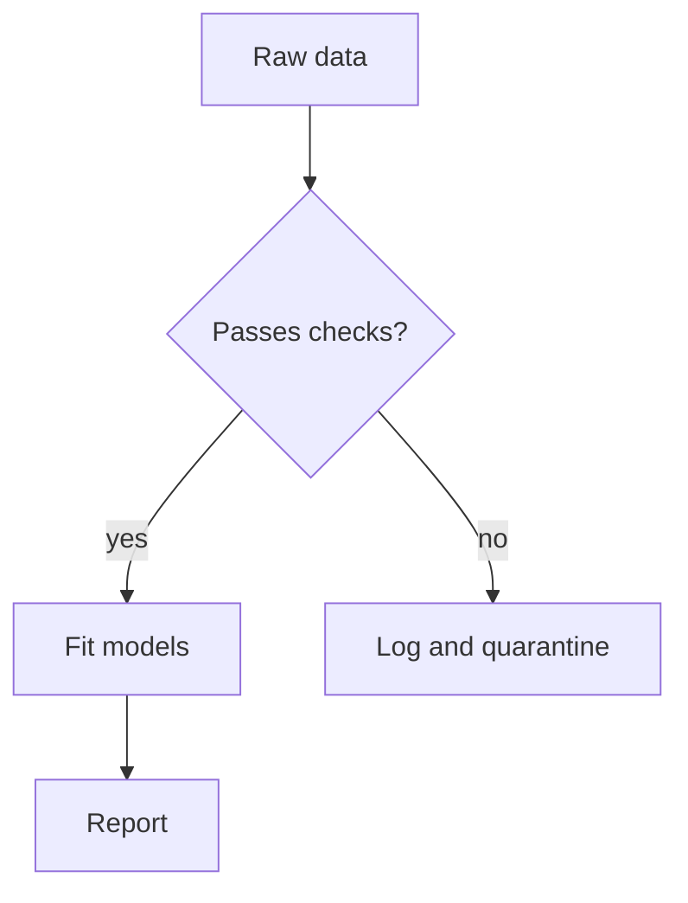

A post is one Markdown file in `src/content/posts/`. The filename sets the
URL: `2026-01-12-writing-posts.md` becomes `/posts/writing-posts`, with the date
prefix stripped. Add `slug:` to the frontmatter to override that.

## Frontmatter

```yaml
---
title: How posts are written here
date: 2026-01-12          # falls back to the filename prefix
updated: 2026-01-20       # optional, shown next to the date
authors: [kiarash]        # ids from src/content/authors.ts
tags: [meta, tooling]
summary: One or two sentences for the list pages.
draft: false              # drafts show in `npm run dev`, never in a build
doi: 10.5281/zenodo.0     # optional, linked from the post header
---
```

Omit `summary` and the first couple of hundred characters of the post are used
instead.

## Math

Inline math goes between single dollars: $\sigma^2 = \mathbb{E}[(X-\mu)^2]$.
Display math uses double dollars:

$$
\hat\beta = (X^\top X)^{-1} X^\top y
$$

Environments work too, since KaTeX handles them:

$$
\begin{aligned}
\log p(y \mid \theta) &= \sum_{i=1}^n \log p(y_i \mid \theta) \\
                      &= -\frac{n}{2}\log(2\pi\sigma^2) - \frac{1}{2\sigma^2}\sum_i (y_i - \mu)^2 .
\end{aligned}
$$

`\strict` is off and errors do not throw, so a malformed expression renders in
red rather than blanking the page.

## Code

Fenced blocks are highlighted by highlight.js. The language label sits in the
top-right corner and a copy button appears on hover.

```r
fit <- lm(mpg ~ wt + factor(cyl), data = mtcars)
summary(fit)$coefficients[, c("Estimate", "Std. Error")]
```

```bash
npm run dev      # drafts visible
npm run build    # type-check, then bundle to dist/
npm test         # unit tests for the content pipeline
```

Unknown languages are left unhighlighted rather than guessed at.

## Diagrams

A fence tagged `mermaid` renders as a diagram, and re-renders when the reader
switches theme:

````markdown

````

Which gives:


Mermaid is loaded on demand, so posts without a diagram never pay for it.

## Tables, footnotes, task lists

GitHub-flavoured Markdown is on, so tables, strikethrough, footnotes[^why] and
task lists all work:

- [x] Pagination on the index and on tag pages
- [x] Full-text search over titles, tags, authors and body
- [ ] An RSS feed

[^why]: Footnotes collect at the bottom of the post with a link back to the
    reference.

## Comments

Each post gets a giscus thread keyed on its path, so renaming a file starts a
new thread. Fill in `repoId` and `categoryId` in `src/site.config.ts` to turn
comments on.
