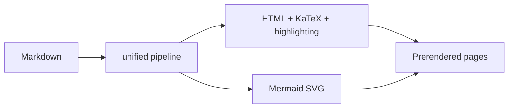
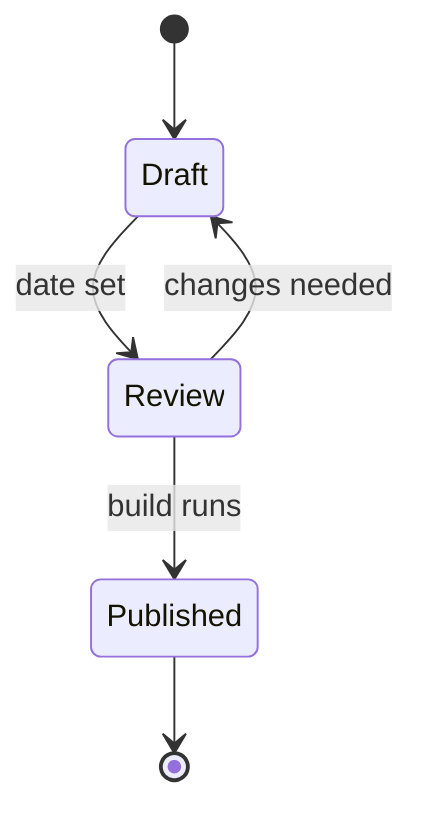
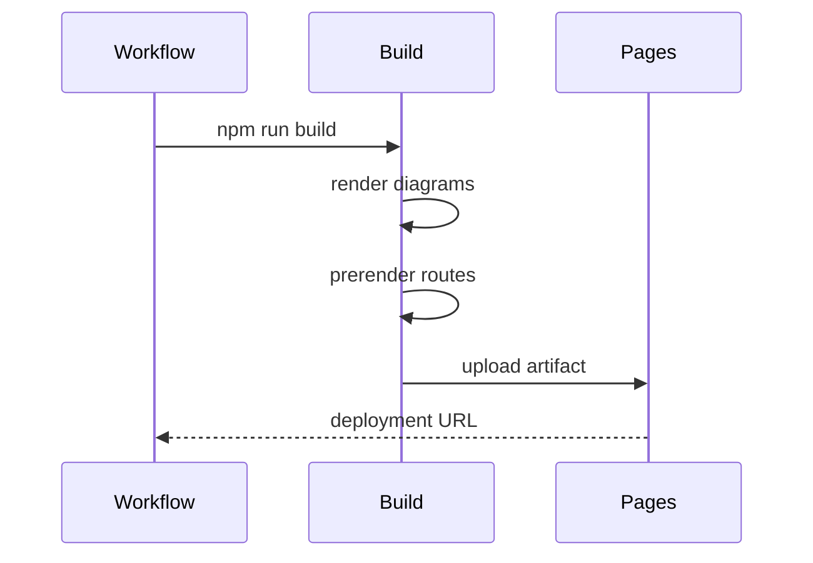

A fence tagged `mermaid` becomes a diagram:

Caption: What the build does to a post. A diagram is captioned like anything
else, by following it with a paragraph that starts with `Caption:`.

Mermaid is about 3 MB of JavaScript. Rather than send that to readers, the
build renders each diagram twice — once against the light palette, once against
the dark one — and inlines both as SVG. CSS shows whichever matches the
reader's theme, so switching theme swaps the diagram with no request and no
flash. During `npm run dev` the diagrams render in the browser instead, which
keeps the edit loop fast.

## Other diagram types

Anything Mermaid supports works. A state machine:

A sequence:

## When a diagram fails

A diagram Mermaid cannot parse does not break the build. The failure is
reported on the console with the post it came from, and the block falls back to
rendering in the browser, where the error appears in place with the source
underneath it. That way a typo in one diagram costs you one diagram.
