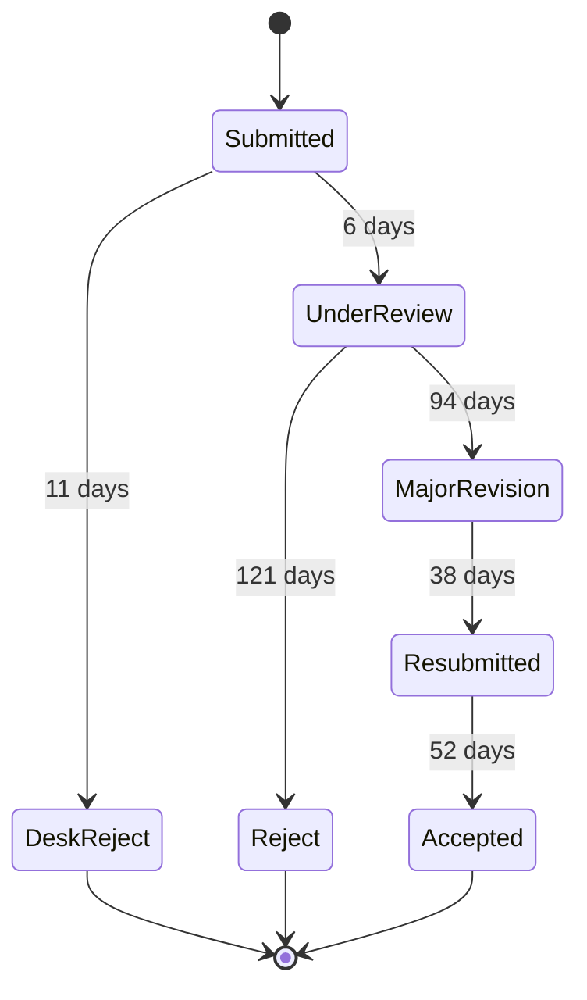

I kept the timestamps for a paper that went out in May 2025 and appeared in
March 2026. The editorial delays were not where I expected them.

Two desk rejects at 11 and 9 days, one full review ending in rejection at 121
days, then the version that landed. The 38 days between "major revision" and
resubmission were mine, and 31 of them were spent on one referee's request to
rerun the experiments with a different normalisation, which changed the third
decimal place.

The useful lesson was not about the referees. It was that the two desk rejects
cost 20 days combined and would have cost the same if I had sent them on day
one to the journals I eventually published in. Submitting in descending order
of prestige has an option value; it also has a serial cost that nobody puts in
the calculation.

I now send a one-paragraph presubmission enquiry to the top choice before
formatting anything. Two editors have replied within four days, both saying no.
That is 20 days saved for the cost of writing a paragraph.
