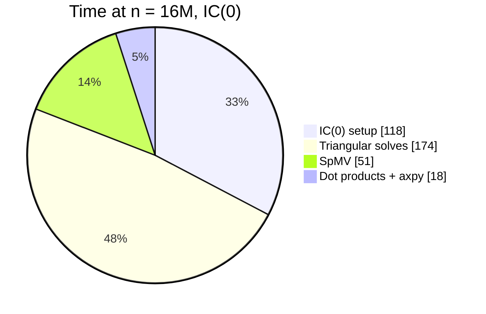

Conjugate gradients on $Ax = b$ converges in a number of iterations governed by
$\sqrt{\kappa(A)}$, where $\kappa$ is the spectral condition number. A
preconditioner $M \approx A$ replaces that with $\sqrt{\kappa(M^{-1}A)}$, and the
question is always whether the reduction in iterations pays for the cost of
building and applying $M$.

For the covariance matrices in our ensemble Kalman filter, $A$ is sparse with
roughly 27 nonzeros per row (a 3D stencil) and $\kappa(A)$ grows like $h^{-2}$.

## The measurements

Three configurations on the same problem family, run on 64 MPI ranks:

| $n$ | No preconditioner (iters / s) | IC(0) (iters / s) | Setup (s) |
| --- | --- | --- | --- |
| 250 k | 412 / 3.1 | 61 / 0.9 | 0.4 |
| 1 M | 786 / 14.2 | 94 / 4.1 | 2.1 |
| 4 M | 1,533 / 71.5 | 141 / 32.8 | 14.6 |
| 16 M | 2,987 / 402 | 208 / 361 | 118 |

At 16 million unknowns the iteration count still drops by a factor of 14, and
the total time barely moves. The setup is a third of the budget, and the
triangular solves do not parallelise: each application is two sequential sweeps
through a factor that no longer fits in cache.

## Where the time goes



The triangular solves are the problem, not the factorisation. Block-Jacobi with
IC(0) inside each block removes the sequential dependency across ranks and cost
us 40 extra iterations, which was a clear win above 4 million.

```cpp
// Level-scheduled forward solve. The level sets are computed once, when the
// sparsity pattern is built, and reused for every application of M.
for (int level = 0; level < num_levels; ++level) {
  const auto& rows = levels[level];
  #pragma omp parallel for schedule(static)
  for (std::size_t k = 0; k < rows.size(); ++k) {
    const int i = rows[k];
    double sum = b[i];
    for (int p = row_ptr[i]; p < diag_ptr[i]; ++p) {
      sum -= values[p] * x[col_idx[p]];
    }
    x[i] = sum / values[diag_ptr[i]];
  }
}
```

Level scheduling recovers some of it, but the level count on our stencil grows
with the grid dimension, so the available parallelism per level shrinks exactly
when it is needed most.

## What I would try next

Sparse approximate inverses apply as a matrix-vector product, which
parallelises, at the cost of a much more expensive setup and more memory.
For the filter we run, the same preconditioner is reused across roughly 200
solves per assimilation window, so a setup cost of two minutes amortises to
under a second per solve. That changes the arithmetic entirely, and it is the
experiment I have not run yet.
